# gk646

**`Aspiring Software Engineer`**

I'm currently studying artificial intelligence and enjoy creating useful open source software.  
My favorite language is `C++`, but I also worked with `Java`, `C`, `Python`, and `Lua`.

Iam active in the fields of:

- 🎮 Game Development
- 🔒 Cybersecurity
- 🤖 Artificial Intelligence

In these fields, I focus on developing:

- 🛠️ Libraries & Frameworks
- 📦 Applications
- 🧩 Plugins

Feel free to reach out for questions or requests: `gk646@proton.me`

---

 
  

