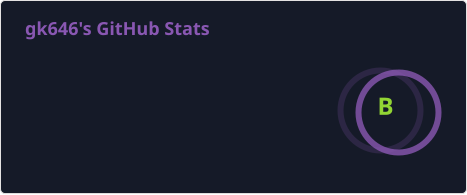
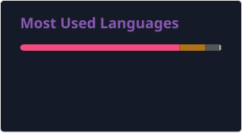

# gk646

**`Aspiring Software Engineer`**

I enjoy creating useful open source software and finding creative solutions for problems.   
My favorite language is `C++`, but I also worked with `Java`, `C`, `Python`, and `Lua`.

Iam interested in: `Game Development` , `Desktop Applications`, `Plugins` and `Low-level programming`.

Feel free to reach out for questions or requests: `gk646@proton.me`

---

 
  

